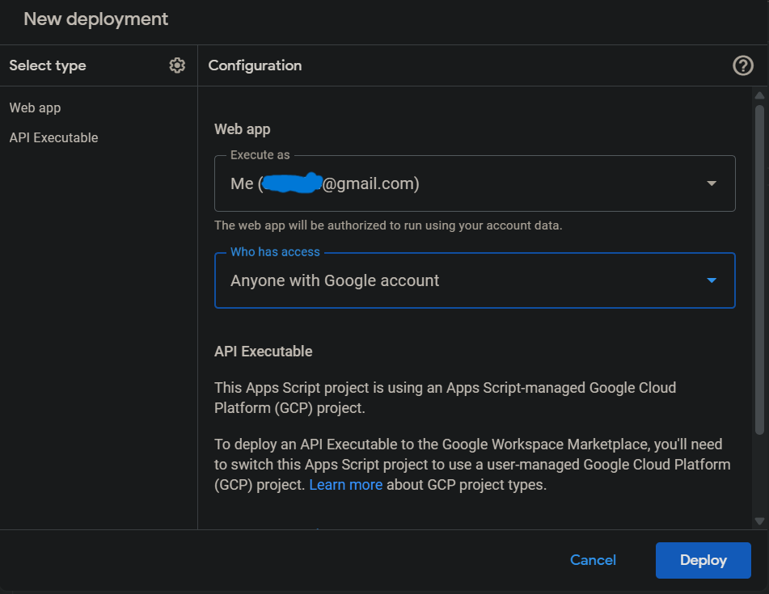

### Setup your database
1. Create a new `Google Sheet` into your Google Drive.
2. Click `Extensions > App Script`
3. Copy js code from the`DB_Code.js` file and paste that into the `Code.gs` file.

[DB_Code.js](./DB_Code.js)